# Nsy Broadcasting Platform 项目汇报手册

> 用途：大赛项目汇报 / 项目评审材料  
> 项目定位：面向本地直播制作、智能导播、实时滤镜、自由场景编排和云推流的一体化导播平台。  
> 写作方式：本文档采用段落式说明，不使用表格，便于后续整理成答辩稿、项目申报书或 PPT 讲稿。  
> 当前文档依据：本地代码库 `nsy_broadcasting_platform/` 与 `cloud_stream_go/` 的实际实现整理。

---

## 1. 项目概述

Nsy Broadcasting Platform 是一个面向直播制作、校园赛事直播、融媒体导播和轻量化演播场景的智能导播平台。项目以传统导播台的工作流为基础，围绕“场景、图层、输入源、编辑预览、节目输出、推流录制”构建核心能力，并在此基础上加入语义智能导播、实时智能滤镜、无限画布自由编排、音轨调音台和云推流服务。

项目的设计目标不是做一个简单的视频播放器或录屏工具，而是提供一个完整的直播制作工作站。用户可以在本地完成多源采集、场景组合、图层管理、画面预览、节目切换、音频处理和智能视觉增强，再把最终节目输出推送到云服务器，由云端完成公网分发、HLS 播放和后续转推。

从产品形态上看，它更接近一个“AI 智能增强导播台”。传统导播台解决的是“如何把多路信号切出去”，本项目进一步解决“如何更智能地选择画面、增强画面、组织复杂场景，并把结果稳定发布到云端”。

导播平台基础功能承担整个系统的底座。它负责创建场景、管理图层、采集摄像头/屏幕/窗口/网络流/图片/视频等输入源，并通过渲染线程合成编辑预览和节目输出。用户可以控制转场、延迟、紧急占位、录制和推流。

智能导播功能负责把用户的中文语义输入转化为场景推荐。系统会读取当前场景缩略图，使用 FG-CLIP2 图文双塔 ONNX 模型计算“文本描述”和“场景画面”的相似度，从而给出最符合用户意图的推荐场景。当前实现重点是推荐模式，让系统辅助导播员决策，而不是未经确认地自动切换节目输出。

智能滤镜功能负责增强画面表现力。项目已经实现基础色彩调节、马赛克、MediaPipe 虚拟背景、MediaPipe AR 贴纸，以及卡通化、莫奈风格、梵高风格等 ONNX 风格迁移滤镜。它们都被放入图层级处理链，因此不同图层可以独立启用不同效果。

无限画布功能负责复杂场景的自由编排。传统导播软件通常依赖线性列表来管理场景和图层，而本项目把场景表现为画布中的“场景框”，把图层表现为可拖动、可缩放、可编辑的对象。用户可以把图层拖入或拖出场景框，也可以把画布组合结果写回已有场景或保存为新场景。

云推流功能负责把本地节目输出发布到服务器。当前项目中包含 Go 编写的云推流服务，配合 MediaMTX 和 FFmpeg，在阿里云 ECS 上接收本地 RTMP 推流，并提供 RTMP/HLS 播放地址，也为后续转推到阿里云直播平台预留了接口。

一句话概括：本项目将传统导播台的多源采集、图层合成和节目输出能力，与语义模型、实时智能滤镜、无限画布编排和云端推流服务整合，形成面向直播制作场景的 AI 智能增强导播平台。

---

## 2. 总体技术架构

项目采用本地桌面端和云端服务分离的架构。本地端负责实时交互、采集、合成、AI 处理、预览、录制和推流；云端服务负责接收 RTMP 流、提供公网播放地址，并可通过 FFmpeg Relay 转推到第三方直播平台。这种分工可以让本地电脑专注于节目制作，让服务器承担公网分发和转发压力。

桌面 GUI 层使用 PyQt6 实现。主窗口、预览窗口、图层管理窗口、语义智能导播窗口、无限画布窗口、音轨调音台和 AI 子界面都建立在 PyQt6 之上。项目通过 `nsy_broadcasting_platform/ui/theme.py` 统一界面风格，使主界面和子界面在视觉上保持一致。

视频采集层主要由 OpenCV、mss 和 Windows 窗口采集能力组成。摄像头源、屏幕源、窗口源、网络流、图片源和视频文件源都被封装成独立的输入源对象，并由 `SourceManager` 统一管理。每个输入源可以运行在自己的采集线程中，避免主界面阻塞。

视频渲染层由 NumPy 和 OpenCV 实现。`Compositor` 会读取当前场景中的图层，根据图层优先级排序，逐层获取帧、应用滤镜、调整尺寸、裁剪画布范围，并最终合成到节目画布上。这个合成结果会分别用于编辑预览、节目输出、推流和录制。

编码输出层使用 PyAV 调用 FFmpeg 编码能力。系统根据用户配置选择 CPU 或 GPU 编码策略，优先尝试 NVIDIA NVENC，如果不可用则回退到 libx264。推流模式使用低延迟编码参数，录制模式则更偏向画质。

音频层使用 pyaudiowpatch、pyaudio 和 pycaw。系统既能采集系统声音和麦克风，也能根据窗口源匹配进程音轨，实现更精细的窗口音频隔离。音轨数据进入 `AudioController` 后，可以进行音量、静音、幅度和低中高频处理，再分发给监听器和编码器。

智能视觉层主要由 MediaPipe 和 ONNX Runtime 构成。MediaPipe 用于人像分割和人脸关键点检测，分别服务于虚拟背景和 AR 贴纸。ONNX Runtime 用于加载本地风格迁移模型和 FG-CLIP2 语义模型。项目中的 `gpu_runtime.py` 会优先尝试 CUDA、DirectML 等 GPU Provider，并在失败时自动回退到 CPU。

云端服务层使用 Go 编写。Go 服务负责生成推流和播放地址、管理 FFmpeg Relay 进程、提供健康检查接口和转推控制接口。MediaMTX 负责接收 RTMP 并输出 RTMP/HLS。FFmpeg Relay 负责把云服务器上接收到的直播流转发到阿里云直播等目标地址。

### 2.1 总体数据流

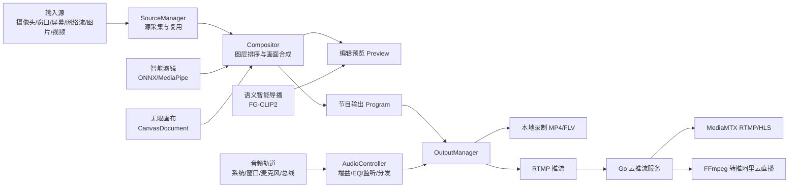

### 2.2 核心代码结构说明

`main.py` 是项目入口。它会检测当前解释器是否为项目自己的 `.venv`，如果不是，则尝试用项目虚拟环境重新启动。这保证用户即使从系统 Python 启动，也能尽量进入正确依赖环境。

`nsy_broadcasting_platform/app.py` 负责启动 PyQt 应用、预加载 ONNX Runtime、设置全局样式，并创建主窗口。它是桌面端应用进入 GUI 工作流的起点。

`nsy_broadcasting_platform/models.py` 定义了核心数据结构，包括 `LayerType`、`Layer`、`Scene`、`AudioTrack`、`TransitionConfig` 和 `AudioDiagnostics`。这些模型让场景、图层、音轨和转场配置有稳定的数据表达。

`nsy_broadcasting_platform/core/state.py` 是全局状态中心。它负责默认场景初始化、场景数量调整、紧急占位场景固定在最后、图层增删改、优先级归一化、音轨选择和转场配置保存。

`nsy_broadcasting_platform/capture/` 目录负责各类输入源采集。摄像头、屏幕、窗口、网络流、图片和视频文件都有对应的 Source 实现，公共线程逻辑封装在 `BaseVideoSource` 中，源的创建、复用和释放由 `SourceManager` 管理。

`nsy_broadcasting_platform/render/` 目录负责画面合成和节目输出。`Compositor` 完成图层级渲染，`RenderThread` 负责持续生成编辑预览、节目输出、场景缩略图和图层指标，`transitions.py` 负责硬切、叠化、划像、DVE 和媒体转场。

`nsy_broadcasting_platform/output/` 目录负责录制和推流。`OutputManager` 管理录制线程和推流线程，`EncoderWorker` 负责音视频编码、时间戳对齐、RTMP 输出和文件输出。

`nsy_broadcasting_platform/audio/` 目录负责音频采集与处理。系统声音、窗口音轨、麦克风输入、监听输出和音频诊断都在这里完成，调音台界面则位于 `ui/audio_mixer_dialog.py`。

`nsy_broadcasting_platform/semantic_director/` 目录负责语义智能导播。`engine.py` 加载 FG-CLIP2 图像编码器和文本编码器，`worker.py` 通过后台线程提交推荐任务，避免阻塞 GUI。

`nsy_broadcasting_platform/canvas/` 目录负责无限画布。`models.py` 定义画布文档和画布对象，`bridge.py` 负责导播台场景/图层与画布对象之间的互相转换，`workspace.py` 实现无限画布交互界面。

`cloud_stream_go/` 目录是 Go 云推流服务。它包含 Go API 服务、MediaMTX 配置、安装脚本、安全组脚本和云推流说明文档，用于部署到阿里云服务器。

---

## 3. 导播平台基础功能

导播平台基础功能是整个项目的运行基础。它解决的是直播制作中的核心问题：如何采集多路输入源，如何把这些输入源组织成场景，如何通过图层控制画面遮挡关系，如何区分编辑预览和节目输出，如何把最终节目稳定录制和推流。

系统默认创建九个普通场景，并额外创建一个紧急占位场景。普通场景用于日常导播切换，占位场景用于直播事故处理。紧急占位场景始终固定在最后，不参与普通场景网格的常规删除和清空逻辑，从而保证事故处理入口始终存在。

图层是场景中的基本画面单位。每个图层记录自己的输入源类型、启用状态、锁定状态、画布位置、尺寸、基础滤镜参数、音量、优先级和具体来源参数。当前支持的图层类型包括摄像头、屏幕、窗口、网络流、视频文件和 PNG 图片。

图层遮挡关系不再依赖列表上下位置，而是依赖优先级编号。编号越大，图层在画面中越靠上。渲染时系统会先绘制低优先级图层，再绘制高优先级图层。这样用户可以通过修改编号明确控制遮挡关系，避免拖拽列表造成理解混乱。

输入源采集由 `SourceManager` 统一负责。系统会根据图层类型和来源参数生成源签名，如果签名没有变化就复用原有采集源，如果签名发生变化则停止旧源并创建新源。这样可以避免频繁重新打开摄像头、窗口或网络流，提高稳定性。

画面合成由 `Compositor.render_scene()` 完成。它会创建一张黑色画布，然后按优先级遍历场景图层。对于每个启用图层，系统先获取最新帧，再执行基础滤镜、ONNX 风格滤镜、AR 贴纸、虚拟背景等处理，最后根据图层位置和尺寸缩放并绘制到画布上。

节目输出由 `RenderThread` 统一生产。编辑预览始终显示当前正在编辑的场景，节目输出则根据导播状态显示当前节目场景。如果紧急占位被启用，节目输出切换到占位场景，但编辑预览保持不变。这一点符合真实导播台中 Preview 和 Program 分离的工作流。

推流和录制由 `OutputManager` 管理。它会把节目输出帧推送给录制 Worker 和推流 Worker。两个 Worker 共用同一份 Program Frame，保证“推流画面”和“节目输出画面”一致，避免本地看见的节目和观众看到的画面不一致。

### 3.1 关键公式

图层排序逻辑可以概括为：

```text
ordered_layers = sort(scene.layers, key=(priority, original_index))
```

带透明通道的图层采用 Alpha 混合：

```text
Output = Source_RGB * Alpha + Destination_RGB * (1 - Alpha)
```

节目延迟通过时间戳队列实现：

```text
target_time = current_time - delay_ms / 1000
program_frame = latest_frame_before(target_time)
```

视频编码时间戳会参考音频时间戳，避免音画不同步：

```text
video_pts = max(time_elapsed * fps, audio_pts / sample_rate * fps, last_video_pts + 1)
```

### 3.2 核心流程伪代码

```text
function render_scene(scene):
    canvas = create_black_canvas(width, height)
    ordered_layers = sort(scene.layers, by priority ascending)

    for layer in ordered_layers:
        if layer.enabled is false:
            continue

        frame = source_manager.get_frame(layer.id)
        if frame is null:
            continue

        if layer.type is not PNG:
            frame = apply_basic_filters(frame, saturation, contrast, color_temp, mosaic)

        if layer.source.onnx_style != none:
            frame = apply_onnx_style(frame, layer.source.onnx_style)

        if layer.source.face_enabled:
            frame = apply_ar_sticker(frame, layer.source.effect_type)

        if layer.source.virtual_bg_enabled:
            frame = apply_virtual_background(frame, layer.source.virtual_bg_mode)

        resized = resize(frame, layer.width, layer.height)
        clipped = clip_to_canvas(resized, layer.x, layer.y)

        if clipped has alpha:
            canvas = alpha_blend(canvas, clipped)
        else:
            canvas = copy_rgb(canvas, clipped)

    return canvas
```

```text
function render_thread_loop():
    while running:
        scenes = state.snapshot_scenes()
        active_scene = state.get_active_scene()
        emergency_active = state.get_emergency_placeholder_active()

        preview_frame = compositor.render_scene(active_scene)

        if emergency_active:
            program_scene = placeholder_scene
        else:
            program_scene = active_scene

        program_frame = compositor.render_scene(program_scene)

        if scene_changed and not emergency_active:
            program_frame = transition.render(old_frame, program_frame)

        program_frame = delay_queue.apply(program_frame, delay_ms)

        emit_preview(preview_frame)
        emit_program(program_frame)
        output_manager.push_video_frame(program_frame)
```

### 3.3 建议截图

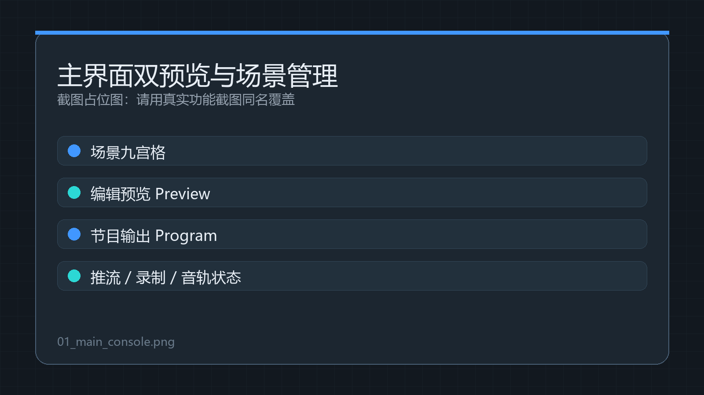

这张截图建议展示主界面的完整工作区，包括场景九宫格、编辑预览、节目输出、RTMP 地址、开始推流、停止推流、开始录制、停止录制、音轨选择和运行状态。它用于说明项目已经具备完整导播台基础工作流。

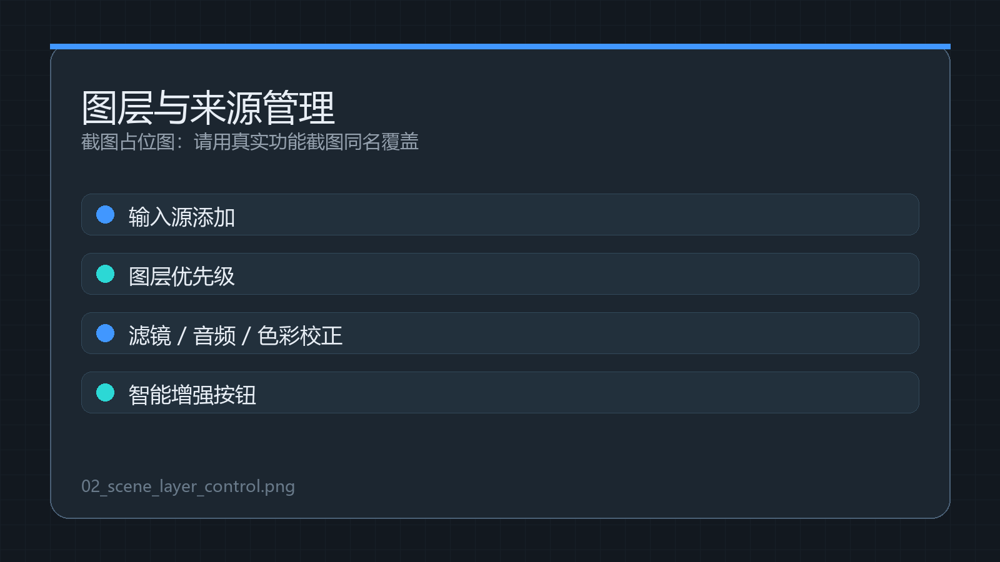

这张截图建议展示某个场景内的多图层管理状态，包括输入源添加、图层名称、优先级编号、滤镜按钮、音频按钮、色彩校正按钮和智能增强按钮。它用于说明项目的图层控制不是简单列表，而是具备细粒度参数编辑能力。

---

## 4. 智能导播功能

智能导播模块面向“根据语义选择画面”的直播场景。传统导播依赖人工观察多个画面并手动选择场景，而本项目允许用户输入中文语义，例如“主持人特写”“产品展示”“舞台远景”“包含观众的画面”，系统会根据场景缩略图自动计算最匹配的场景。

该功能当前采用推荐模式，而不是完全自动切换模式。推荐模式的优势是安全可控：模型负责从大量场景中筛选候选结果，导播员负责最终确认是否切换。这种设计适合比赛汇报和真实直播场景，因为它既体现 AI 辅助能力，又避免模型误判导致直播事故。

技术上，智能导播采用 FG-CLIP2 图文双塔模型。文本编码器负责把用户输入的中文描述转为语义向量，图像编码器负责把场景缩略图转为图像向量。由于两个向量处在同一语义空间，系统可以通过点积计算它们的相似度。

场景缩略图来自渲染线程生成的 QImage。系统会把 QImage 转为 RGB 数组，再根据 FG-CLIP2 模型配置进行 resize、normalize 和 patchify。这样可以避免引入更重的 transformers 运行库，使本地部署更轻量。

ONNX 会话由 `gpu_runtime.create_session()` 创建。它会优先尝试 GPU Provider，例如 CUDA 或 DirectML，如果失败则回退到 CPU。推荐任务运行在 `SemanticRecommendationWorker` 后台线程中，因此用户界面不会因为模型推理而卡顿。

### 4.1 技术路径

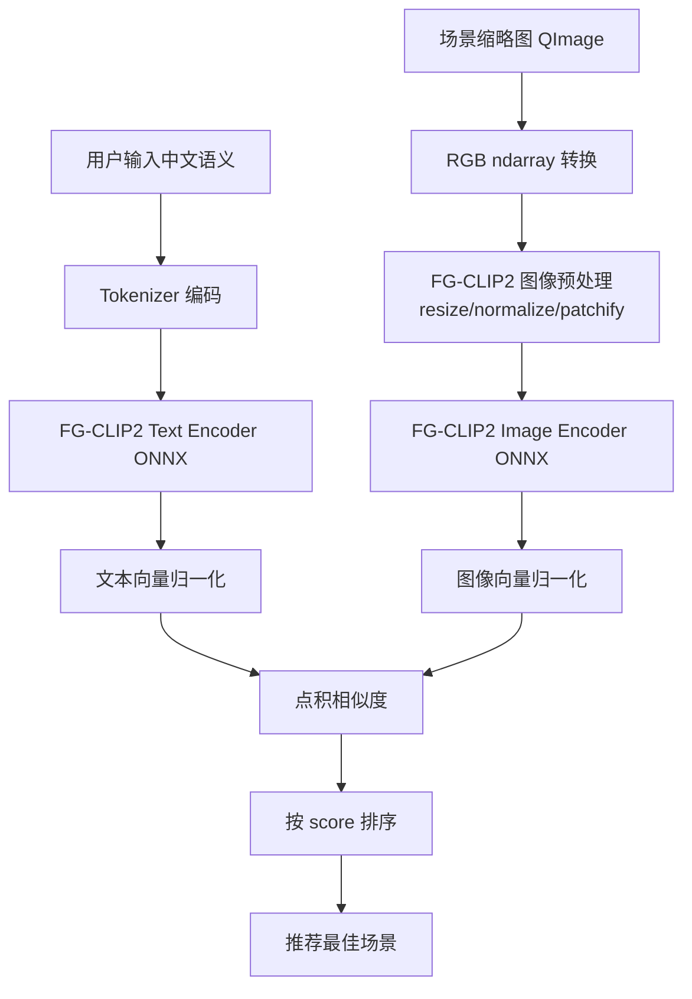

### 4.2 核心公式

图文相似度计算如下：

```text
image_emb = normalize(image_encoder(scene_thumbnail))
text_emb  = normalize(text_encoder(query))
score     = image_emb · text_emb
```

推荐决策可以概括为：

```text
best_scene = argmax(score_i)
if score_best >= threshold:
    return best_scene
else:
    return no_switch_recommendation
```

### 4.3 核心流程伪代码

```text
function recommend_scene(query, scene_thumbnails, threshold):
    if query is empty:
        return error("请输入语义搜索词")

    text_embedding = encode_text(query)
    results = []

    for scene in scene_thumbnails:
        image_embedding = encode_image(scene.thumbnail)
        if image_embedding is null:
            continue

        score = dot(normalize(image_embedding), normalize(text_embedding))
        reason = "FG-CLIP2 图文相似度命中"
        results.append(scene.id, scene.name, score, reason)

    results = sort(results, by score descending)

    if results[0].score >= threshold:
        return recommendation(best_scene=results[0], all_scores=results)
    else:
        return recommendation(best_scene=null, all_scores=results)
```

### 4.4 建议截图

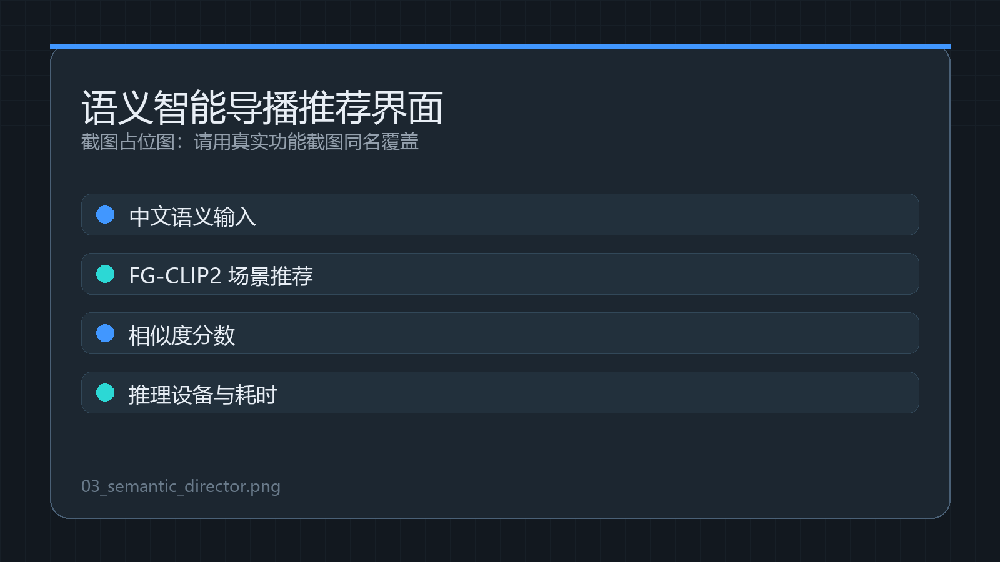

这张截图建议展示中文语义输入框、推荐场景名称、相似度分数、推理设备、推荐耗时，以及定位或切换相关按钮。它用于说明系统具备“根据中文语义理解画面内容”的能力。

---

## 5. 智能滤镜功能

智能滤镜模块把传统图像处理和 AI 视频增强整合到图层处理链中。项目中的每个图层都可以独立设置滤镜参数，因此摄像头图层、窗口图层、图片图层和网络流图层可以拥有不同的视觉效果。

基础视频滤镜包括饱和度、对比度、色温和马赛克。这部分主要通过 OpenCV 和 NumPy 对图像像素进行变换，计算成本较低，适合实时预览和节目输出。

ONNX 风格迁移滤镜使用项目本地 `onnx_models` 目录中的模型文件。`cartoon.onnx` 用于卡通化，`monet.onnx` 用于莫奈风格，`vangogh.onnx` 用于梵高风格。模型采用懒加载和缓存机制，避免应用启动时一次性加载所有模型造成卡顿。

当 ONNX 模型不可用、输出异常或推理结果退化时，系统不会直接报错中断，而是自动降级到本地近似滤镜。这种设计可以提高比赛演示和真实使用中的稳定性：即使某台电脑 ONNX Runtime 或 GPU 环境有问题，滤镜入口仍能给出可见效果。

虚拟背景功能基于 MediaPipe Selfie Segmentation。系统先对人像区域生成分割掩码，再进行时间平滑、腐蚀和模糊处理，最后将前景人物与背景图片或模糊背景合成。这样可以减少边缘抖动和割裂感。

AR 贴纸功能基于 MediaPipe FaceMesh。系统使用人脸关键点估计鼻尖、眼睛、额头和下巴位置，再计算贴纸的中心点、缩放比例和旋转角度。贴纸采用 BGRA 图片，并通过 Alpha 混合叠加到人脸位置。

为了减少启动卡顿，项目提供 ONNX 与 MediaPipe 预热能力。ONNX 模型可以在后台线程预加载，MediaPipe 组件也可以提前初始化。实际渲染时，`Compositor` 会缓存每个图层对应的虚拟背景滤镜和人脸滤镜实例，避免每帧重新创建对象。

### 5.1 技术路径

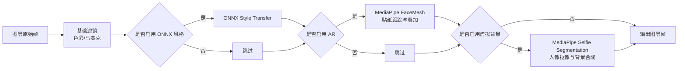

### 5.2 关键公式

虚拟背景合成公式如下：

```text
Result = Foreground * Mask + Background * (1 - Mask)
```

AR 贴纸的 Alpha 混合公式如下：

```text
ROI_new = Sticker_RGB * Alpha + ROI_old * (1 - Alpha)
```

ONNX 风格迁移结果与原图混合公式如下：

```text
StyledOutput = Source * (1 - strength) + StyleFrame * strength
```

音频电平转 dB 的公式如下：

```text
dB = 20 * log10(max(level, 0.0001))
```

### 5.3 核心流程伪代码

```text
function apply_onnx_style_filter(frame, style):
    if style == none:
        return frame

    style_filter = style_cache.get(style)
    if style_filter is null:
        preload_style_filter_async(style)
        return fallback_style_filter(frame, style)

    output = style_filter.run_onnx(frame)

    if output is invalid or degenerate:
        output = fallback_style_filter(frame, style)

    return blend(frame, output, strength)
```

```text
function virtual_background(frame, background):
    mask = mediapipe_segmentation(frame)
    mask = temporal_smooth(mask)
    mask = erode_and_blur(mask)

    if mode == blur:
        bg = gaussian_blur(frame)
    else:
        bg = fit_background_image(background, frame.size)

    return frame * mask + bg * (1 - mask)
```

```text
function ar_face_sticker(frame, sticker):
    landmarks = face_mesh(frame)
    if no face:
        return hold_last_sticker_or_original(frame)

    nose = landmarks[nose_index]
    left_eye = landmarks[left_eye_index]
    right_eye = landmarks[right_eye_index]

    eye_distance = distance(left_eye, right_eye)
    angle = estimate_face_angle(landmarks)
    center = smooth(nose)

    transformed_sticker = resize_rotate(sticker, eye_distance, angle)
    return alpha_blend(frame, transformed_sticker, center)
```

### 5.4 建议截图

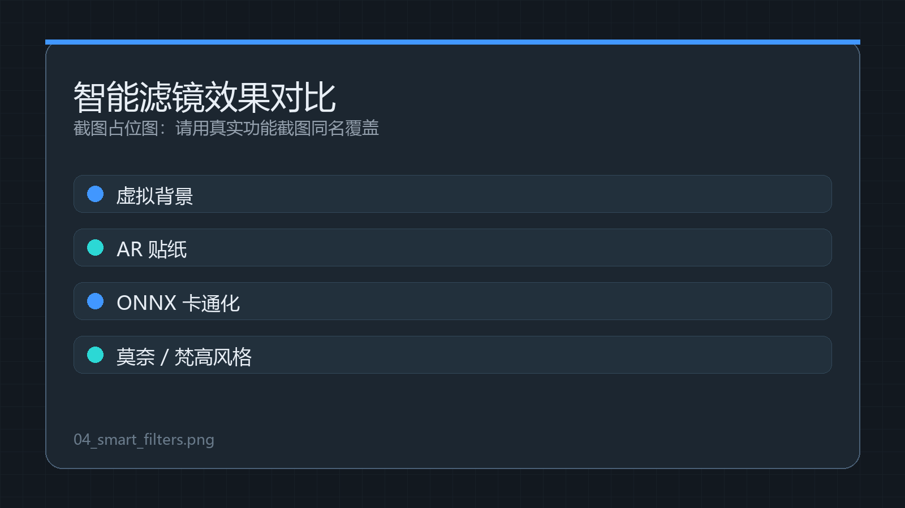

这张截图建议展示原始画面、虚拟背景、AR 贴纸、卡通化、莫奈风格和梵高风格。最好采用对比拼图方式，让评委一眼看到 AI 视觉增强效果。

---

## 6. 无限画布功能

无限画布模式解决的是复杂场景编排不直观的问题。在传统导播界面中，场景和图层通常被压缩在线性列表里，用户只能通过列表选择、按钮调整和参数输入来修改画面。本项目的无限画布把场景和图层放到一个可缩放、可平移的空间中，使用户能够像搭建视觉工作区一样组织直播内容。

在画布模式下，场景表现为一个场景框。场景框在逻辑上是图层集合，它可以来源于导播台已有场景，也可以作为新建场景存在。每个场景框都有名称和导播状态，并支持调整比例。

图层是无限画布中的基本元素。图层可以独立存在，也可以归属于某个场景框。用户把图层拖入场景框时，系统视为将该图层加入该场景；用户把图层拖出场景框时，系统视为将该图层从场景中移出。这个过程只改变归属关系，不破坏图层自身的滤镜、音频、大小、来源和智能增强参数。

无限画布中的数据由 `CanvasDocument` 保存。文档包含画布 ID、名称、版本、视口位置、缩放比例、输出框、对象列表、组合信息和创建更新时间。每个对象由 `CanvasItemModel` 表示，里面保存位置、尺寸、旋转、透明度、可见性、锁定状态、层级、裁剪、滤镜、抠像、音频和元数据。

画布和导播台之间通过桥接层连接。`SceneCanvasAdapter` 负责把导播台中的 `Scene` 和 `Layer` 转换成画布对象，也负责把画布对象转回导播台图层。`DirectorCanvasBridge` 负责把画布文档写回已有场景，或者新建一个场景保存。

该设计的关键价值在于“低侵入性”。无限画布没有直接改写导播核心渲染逻辑，而是通过适配层把画布结果转换为原有的场景和图层结构。这样原有的预览、节目输出、推流、录制和滤镜管线都可以继续复用。

### 6.1 技术路径

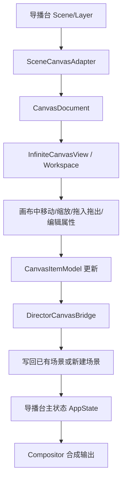

### 6.2 数据结构摘要

`CanvasDocument` 是画布工程文件的核心。它包含 `document_id`、`name`、`version`、`viewport`、`output_frame`、`items`、`groups`、`history_metadata`、`created_at` 和 `updated_at`。这些字段保证画布可以被保存、加载和写回导播台。

`CanvasItemModel` 是画布对象的核心。它包含 `item_id`、`type`、`source_ref`、`scene_ref`、`parent_item_id`、`name`、`x`、`y`、`width`、`height`、`rotation`、`opacity`、`visible`、`locked`、`z_index`、`crop`、`filters`、`chroma_key`、`audio` 和 `metadata`。这些字段让图层对象不仅能摆放，还能保存完整的滤镜、抠像和音频属性。

`CanvasGroupModel` 用于表达对象组合。它包含组合 ID、名称、对象 ID 列表、锁定状态、可见状态和元数据。后续如果要实现 AI 自动排版、多场景模板和组合复用，可以继续扩展这个结构。

### 6.3 核心流程伪代码

```text
function layer_to_canvas_item(layer, scene_id):
    item = CanvasItemModel()
    item.item_id = layer.id
    item.type = layer.layer_type
    item.source_ref = layer.id
    item.scene_ref = scene_id
    item.name = layer.name
    item.x, item.y = layer.x, layer.y
    item.width, item.height = layer.width, layer.height
    item.z_index = layer.priority
    item.filters = copy(layer.filter_params)
    item.audio = copy(layer.audio_params)
    item.metadata.source_snapshot = deep_copy(layer.source)
    return item
```

```text
function document_to_layers(document):
    visible_items = sort(document.items, by z_index)
    scene_items = collect items where type == scene
    children_by_parent = group items by parent_item_id
    output_layers = []

    for item in visible_items:
        if item is scene frame:
            embedded_layers = restore_scene_snapshot(item)
            child_layers = children_by_parent[item.item_id]
            output_layers += expand_scene_frame(item, embedded_layers, child_layers)
        else if item is root layer:
            output_layers.append(canvas_item_to_layer(item))

    normalize_priority(output_layers)
    return output_layers
```

```text
function export_document_to_scene(document, target_scene, create_new):
    if create_new:
        scene = state.add_scene(document.name)
    else:
        scene = state.get_scene_by_id(target_scene)

    if scene is placeholder_scene:
        return error("占位场景不支持画布写回")

    layers = document_to_layers(document)
    state.clear_scene_layers(scene.id)

    for layer in layers:
        state.add_layer(layer, scene.id)

    return success(scene.id)
```

### 6.4 建议截图

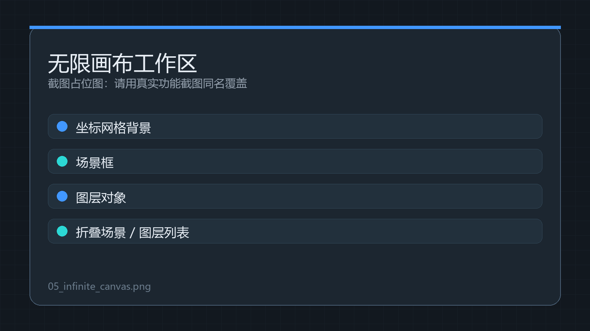

这张截图建议展示深色坐标网格背景、多个场景框、若干图层对象、右上角折叠式场景列表和图层列表，以及画布定位到目标对象后的效果。它用于说明项目不只是传统导播界面，还具备自由创作型工作区。

---

## 7. 云推流功能

云推流模块用于把本地导播台生成的节目输出发布到公网。它的工作方式是：本地导播台把 Program Frame 编码为 RTMP 流，推送到阿里云 ECS 服务器；服务器上的 MediaMTX 接收直播流并提供 RTMP/HLS 播放；Go API 服务负责生成播放地址、检查服务状态和管理 FFmpeg 转推任务。

当前本地导播台默认推流地址为：

```text
rtmp://<YOUR_SERVER_IP>:1935/live/main
```

云端可以提供 RTMP 播放和 HLS 播放。RTMP 地址适合低延迟播放和专业播放器验证，HLS 地址适合浏览器或移动端播放。示例 HLS 地址为：

```text
http://<YOUR_SERVER_IP>:8888/live/main/index.m3u8
```

为了安全，项目手册不记录服务器密码、API Token、阿里云 AccessKey 或其他凭据。比赛材料中只应展示架构、端口、服务状态和播放验证结果，敏感信息应单独保管。

Go 服务的核心价值在于轻量、稳定和适合常驻运行。它提供 `/api/health` 用于健康检查，提供 `/api/urls` 用于生成推流/播放地址，提供 `/api/relay/start` 和 `/api/relay/stop` 用于管理 FFmpeg Relay。这样云推流服务不仅能接收本地推流，还能继续转推到阿里云直播等平台。

FFmpeg Relay 的策略是尽量复制视频流，减少二次编码开销。当前命令中视频使用 `copy`，音频使用 AAC，以保证输出兼容性。这样可以降低云服务器 CPU 压力，提高转推稳定性。

### 7.1 技术路径

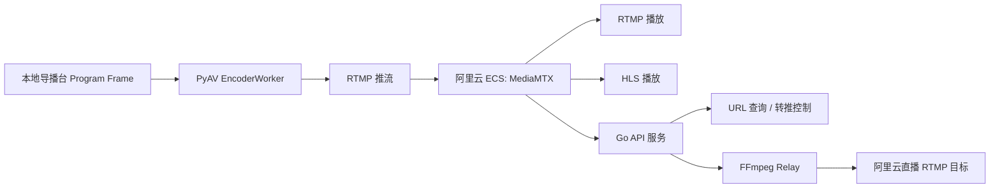

### 7.2 核心流程伪代码

```text
function start_stream_from_director():
    rtmp_url = ui.rtmp_input.value
    worker = OutputManager.start_stream(rtmp_url)

    while streaming:
        program_frame = RenderThread.current_program_frame
        audio_chunk = AudioController.current_audio_chunk
        worker.encode_video(program_frame)
        worker.encode_audio(audio_chunk)
        worker.write_to_rtmp()
```

```text
function cloud_build_url(app, stream):
    app = sanitize(app, fallback="live")
    stream = sanitize(stream, fallback="main")
    path = app + "/" + stream

    return {
        push_url:  "rtmp://public_host:1935/" + path,
        play_rtmp: "rtmp://public_host:1935/" + path,
        play_hls:  "http://public_host:8888/" + path + "/index.m3u8",
        local_input: "rtmp://127.0.0.1:1935/" + path
    }
```

```text
function start_relay(target_url):
    input = "rtmp://127.0.0.1:1935/live/main"
    command = [
        "ffmpeg",
        "-fflags", "nobuffer",
        "-i", input,
        "-map", "0:v:0",
        "-map", "0:a?",
        "-c:v", "copy",
        "-c:a", "aac",
        "-ar", "48000",
        "-b:a", "128k",
        "-f", "flv",
        target_url
    ]
    run_background_process(command)
```

### 7.3 建议截图

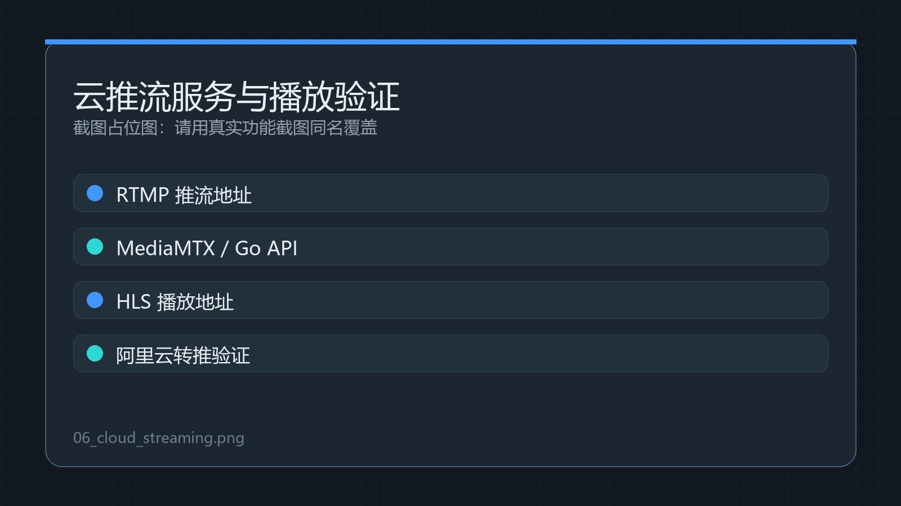

这张截图建议展示本地导播台中的 RTMP 地址、云服务器上的服务状态、HLS 播放地址，以及浏览器、VLC 或 API health 的成功返回结果。它用于证明系统已经从本地节目制作走向云端直播分发。

---

## 8. 音轨调音台与音频处理

音频模块已经从“单一音频采集”升级为“多音轨管理”。系统将音频抽象为不同的音轨，包括自动跟随当前场景窗口、系统声音、麦克风、总音轨和窗口图层音轨。这样的设计更接近真实数字调音台，也更适合后续接入智能降噪、违禁词检测和自动增益模型。

每个窗口图层可以关联自己的窗口音轨。用户选择某个窗口音轨时，系统会尝试通过进程 ID 或进程名匹配音频会话。如果启用严格隔离，系统会屏蔽其他应用的声音，只保留目标窗口音轨。这样可以解决“用户只想采集某个窗口声音，却把其他系统声音也录进去”的问题。

调音台界面采用 Channel Strip 逻辑。每条音轨都显示名称、当前状态、实时电平或声纹，并提供音量推子、静音开关、幅度控制以及低频、中频、高频增益调节。音频电平动画只刷新音频组件自身，避免造成整个主界面重绘。

`AudioController` 是音频处理的中心。它负责选择采集后端、切换麦克风或系统声、应用音轨参数、分发音频队列、启动监听和向编码器提供音频块。项目还保留了 `register_ai_processor()` 接口，后续可以接入 ONNX 降噪模型、敏感词处理模型或大模型音频分析服务。

### 8.1 技术路径

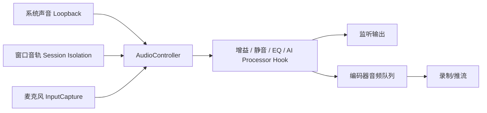

### 8.2 核心伪代码

```text
function set_track_profile(track):
    active_kind = track.kind
    gain = clamp(track.volume, 0, 4)
    muted = track.muted or not track.enabled
    eq = [track.low_gain, track.mid_gain, track.high_gain]

    if track.kind == MICROPHONE:
        use_input_capture(track.device_index)
    else:
        use_loopback_capture(track.device_index)
        set_window_target(track.pid, track.process_name, strict_isolation)
```

```text
function process_audio_chunk(chunk):
    if muted:
        return silence(chunk)

    samples = bytes_to_int16(chunk)
    samples = samples * gain * amplitude
    samples = apply_fft_eq(samples, low_gain, mid_gain, high_gain)

    for ai_processor in registered_processors:
        samples = ai_processor.process(samples)

    return int16_to_bytes(clamp(samples))
```

---

## 9. 编码与性能优化

项目的节目编码采用 CPU 与 GPU 可配置策略。用户可以选择 GPU/NVENC、CPU/x264 或自动模式。在自动模式下，系统优先尝试 GPU 编码，如果不可用则回退到 CPU 编码。这样既能利用有独立显卡设备的性能，又能保证普通设备仍然可运行。

推流编码更强调低延迟和稳定性，因此参数中会使用 `zerolatency`、`bf=0`、较快的 preset 和码率控制。录制编码更强调本地文件质量，因此可以使用更高质量的参数。用户也可以在界面中调整推流码率、录制码率、推流编码方式和录制编码方式。

视频采集方面，每个输入源都有独立采集线程。源管理器通过签名判断是否复用源，避免重复打开设备或网络流。采集帧会被存入最新帧缓存，渲染线程只读取最新帧，减少积压。

渲染方面，Preview 和 Program 由同一个渲染线程组织。Program Frame 会统一推送给推流和录制，因此用户看到的节目输出和实际推流内容保持一致。节目延迟使用时间戳队列实现，切场景和转场时会清理延迟缓存，降低画面闪烁和割裂风险。

智能滤镜方面，ONNX 模型采用懒加载、缓存和异步预热。MediaPipe 虚拟背景和 AR 贴纸使用图层级滤镜实例缓存。模型不可用或输出异常时，系统会降级到本地近似滤镜，保证功能入口不崩溃。

音频方面，采集线程、处理线程和编码线程通过队列解耦。监听输出会丢弃过旧音频块以降低延迟，编码器则根据音频时间戳和视频时间戳进行同步，减少音画不同步。

无限画布方面，拖拽和缩放主要更新对象模型，而不是每次都触发重型导播场景重建。只有在写回场景或同步场景框内容时，系统才把画布文档转换为导播台图层结构。

云推流方面，云端 Relay 尽量使用视频流复制，减少二次编码压力。Go 服务只负责 API、URL 生成和进程管理，MediaMTX 负责流媒体服务，职责分离清晰。

---

## 10. 技术创新点

第一个创新点是图层级 AI 视觉处理链。项目没有把智能滤镜做成独立小工具，而是把基础滤镜、ONNX 风格迁移、虚拟背景和 AR 贴纸全部接入导播图层渲染链。这样每个输入源都可以拥有独立的智能增强能力。

第二个创新点是语义智能导播推荐。项目通过 FG-CLIP2 中文图文匹配，把用户语义意图转化为场景相似度评分。导播员可以用自然语言描述目标画面，系统则根据场景缩略图给出推荐，提升复杂场景下的查找效率。

第三个创新点是无限画布式场景编排。项目把场景从传统列表项升级为画布空间中的集合框，把图层升级为可自由移动的对象。这种方式更适合多场景组合、复杂画面包装和后续 AI 自动排版。

第四个创新点是音轨化音频架构。项目把音频采集从单一总线变成多个基础音轨，支持系统声、窗口声、麦克风、总音轨和图层关联音轨，并提供数字调音台式参数控制。

第五个创新点是本地导播和云端分发解耦。本地端专注实时制作和节目输出，云端 Go 服务、MediaMTX 和 FFmpeg 负责公网分发与转推。这样的架构既方便演示，也适合实际部署。

第六个创新点是 GPU 优先与容错降级。ONNX 模型优先使用 GPU Provider，失败后回退 CPU；智能滤镜模型异常时回退本地近似滤镜；音频和视频源失效时使用占位画面或诊断信息，避免应用直接崩溃。

第七个创新点是紧急占位机制。直播事故发生时，节目输出可以立即切换到占位场景，而编辑预览不受影响。再次关闭占位后，节目输出恢复正常场景。这一机制贴合真实导播安全需求。

---

## 11. 比赛演示流程建议

比赛演示可以先打开主界面，展示九宫格场景、编辑预览、节目输出和推流录制控制。这个步骤用于让评委快速理解项目不是单点功能，而是完整导播台。

接着添加窗口源或摄像头源，调整图层位置、大小、锁定状态和优先级编号。这个步骤用于展示基础导播功能和图层管理能力。

然后启用智能滤镜，例如给摄像头图层开启虚拟背景或 AR 贴纸，再给图片或视频图层开启 ONNX 风格迁移。这个步骤用于突出 AI 智能增强特色。

随后进入语义智能导播界面，输入“主持人特写”“产品展示”等中文语义，让系统生成场景推荐和相似度分数。建议先选择定位推荐场景，再手动切换，体现“AI 辅助但人可控”的设计原则。

接下来打开无限画布，将已有场景加入画布，并把图层拖入或拖出场景框。演示结束时把画布组合写回已有场景或保存为新场景。这个步骤用于展示项目在复杂场景编排上的优势。

最后点击开始推流，展示默认 RTMP 地址和云端播放地址。如果现场条件允许，可以打开浏览器或播放器验证 HLS 播放。如果网络条件不稳定，也可以展示 `/api/health` 和部署说明截图。

演示结束前可以按下紧急占位按钮，展示节目输出立即切换到占位画面，而编辑预览保持原场景不变。这是一个很适合比赛现场展示的安全功能，因为效果直观且贴近真实直播事故处理。

---

## 12. 评委可能关注的问题

如果评委问“这个项目和 OBS 有什么区别”，可以回答：本项目借鉴导播台工作流，但重点不是简单复刻 OBS，而是在基础导播能力上加入语义智能推荐、图层级 AI 滤镜、无限画布编排、音轨化调音台和云推流服务，突出 AI 智能增强和可扩展性。

如果评委问“智能导播会不会误切”，可以回答：当前实现采用推荐模式，模型只给出候选场景和相似度，是否切换由用户确认。这种方式既能提高导播效率，又能避免 AI 误判直接影响节目输出。

如果评委问“实时滤镜会不会卡顿”，可以回答：项目采用 ONNX 懒加载、后台预热、滤镜实例缓存和 GPU 优先策略。模型不可用时会自动降级到本地近似滤镜，保证功能不崩溃。重型处理控制在图层级，不会重写整套渲染管线。

如果评委问“为什么云推流用 Go”，可以回答：Go 适合编写轻量常驻服务，用来管理 API、URL 生成和 FFmpeg Relay 进程。流媒体接收和 HLS 输出交给 MediaMTX，转推交给 FFmpeg，各组件职责明确，部署和维护都比较简单。

如果评委问“无限画布的价值是什么”，可以回答：无限画布把场景和图层从线性列表升级为空间化编排。用户可以在一个画布里同时管理多个场景框和多个图层对象，更适合复杂节目包装、多场景组合和后续 AI 自动布局。

---

## 13. 截图清单

`01_main_console.png` 应展示主界面全景。建议包含场景九宫格、编辑预览、节目输出、推流录制控制和音轨选择，用来证明系统具备完整导播台基础界面。

`02_scene_layer_control.png` 应展示图层管理子界面。建议包含输入源添加、图层优先级、滤镜、音频、色彩校正和智能增强按钮，用来证明系统具备细粒度图层编辑能力。

`03_semantic_director.png` 应展示语义智能导播界面。建议包含中文输入、推荐场景、相似度、推理设备和耗时，用来证明系统可以根据中文语义理解并推荐画面。

`04_smart_filters.png` 应展示智能滤镜效果。建议包含虚拟背景、AR 贴纸、ONNX 卡通化、莫奈风格和梵高风格迁移，用来突出项目的 AI 视觉增强能力。

`05_infinite_canvas.png` 应展示无限画布工作区。建议包含坐标网格背景、场景框、图层对象、折叠列表和属性入口，用来说明项目具备自由编排能力。

`06_cloud_streaming.png` 应展示云推流验证。建议包含本地 RTMP 地址、服务器服务状态、HLS 播放地址或 API health 返回，用来证明项目具备云端发布能力。

截图保存目录为：

```text
docs/competition_manual/screenshots/
```

---

## 14. 核心功能伪代码汇总

### 14.1 源采集复用

```text
function sync_scenes(scenes):
    enabled_layers = collect_enabled_layers(scenes)
    keep_ids = set(layer.id for layer in enabled_layers)

    for source_id in current_sources:
        if source_id not in keep_ids:
            stop_and_remove_source(source_id)

    for layer in enabled_layers:
        signature = build_signature(layer.type, layer.source, capture_quality, capture_fps)
        if source_exists(layer.id) and signature_unchanged(layer.id, signature):
            continue

        stop_old_source(layer.id)
        source = build_source_by_layer_type(layer)
        source.start()
        save_source(layer.id, source, signature)
```

### 14.2 场景切换与转场

```text
function update_program_scene(active_scene_id, emergency_active):
    if emergency_active:
        program_scene_id = placeholder_scene_id
        transition.cancel()
    else:
        program_scene_id = active_scene_id

    if program_scene_id changed and not emergency_active:
        transition.start(config, previous_program_frame)

    new_frame = render_scene(program_scene_id)

    if transition.active:
        program_frame = transition.render(new_frame)
    else:
        program_frame = new_frame

    return program_frame
```

### 14.3 推流编码

```text
function encoder_worker_loop():
    container = open_output(target)
    video_stream = build_video_stream(codec_candidates)
    audio_stream = build_audio_stream(aac)

    while running:
        frame = video_queue.pop(timeout=50ms)
        if frame exists:
            encode_video(video_stream, frame)

        while audio_queue not empty:
            chunk = audio_queue.pop()
            encode_audio(audio_stream, chunk)

    flush(video_stream)
    flush(audio_stream)
    close(container)
```

### 14.4 智能导播推荐

```text
function semantic_recommend(query):
    text_embedding = text_encoder(tokenize(query))
    text_embedding = normalize(text_embedding)

    for scene in scene_previews:
        image_embedding = image_encoder(preprocess(scene.preview))
        image_embedding = normalize(image_embedding)
        scene.score = dot(image_embedding, text_embedding)

    return sort(scene_previews, score descending)
```

### 14.5 无限画布写回

```text
function apply_canvas_to_director(document, target_scene):
    layers = document_to_layers(document)
    state.clear_scene_layers(target_scene)

    for layer in layers:
        state.add_layer(layer, target_scene)

    refresh_scene_list()
    refresh_layer_list()
    render_thread.sync_sources()
```

---

## 15. 当前边界与后续优化方向

当前智能导播以推荐模式为主，不默认自动切换节目输出。这个选择是有意保守的，因为直播场景对安全性要求很高。后续可以在推荐模式稳定后，再加入脚本模式和自动切换模式。

当前 ONNX Runtime 在不同 Windows 设备上可能受 CUDA、DirectML、驱动和 DLL 配置影响。项目已经通过 `gpu_runtime` 提供 GPU 优先和 CPU 回退能力，但后续仍建议增加一键 GPU 诊断界面和模型性能检测工具。

当前云推流需要服务器安全组放行端口，并确保 MediaMTX 和 Go 服务正常启动。后续可以增加云端监控面板，显示推流码率、丢帧、延迟、HLS 状态和在线服务健康度。

当前无限画布已经实现核心编排和写回，但仍可继续增强撤销重做、模板复用、复杂组合、多人协作和 AI 自动排版能力。

后续可以增加 YOLO 与 CLIP 多模型融合，让系统不仅能根据场景缩略图做语义推荐，还能识别画面中的人物、物体和动作，再结合用户的导播脚本实现更准确的自动导播。

后续也可以增强智能音频能力，例如接入 ONNX 降噪、违禁词检测、自动增益、声纹识别和语音事件检测，使平台从“智能画面导播”进一步扩展到“智能音视频导播”。

---

## 16. 运行与部署说明摘要

本地导播台可以在项目根目录运行。推荐命令如下：

```powershell
cd C:\Users\acidrain\PycharmProjects\Nsy_Broadcasting_platform
.\.venv\Scripts\python.exe main.py
```

如果直接执行系统 Python，也可以使用：

```powershell
python main.py
```

`main.py` 会尝试切换到项目自带 `.venv` 后启动，因此对普通用户更友好。

云推流服务部署在服务器上时，可以进入 `cloud_stream_go` 目录并执行安装脚本。示例命令如下：

```powershell
cd "$env:USERPROFILE\Desktop\cloud_stream_go"
Set-ExecutionPolicy -Scope Process Bypass -Force
.\scripts\install_windows.ps1 -PublicHost <YOUR_SERVER_IP>
```

服务器安全组需要放行 RTMP、HLS 和 API 相关端口。RTMP 默认使用 TCP 1935，HLS 默认使用 TCP 8888，Go API 默认使用 TCP 8088，可选扩展端口为 TCP 8890。

本地导播台推流地址为：

```text
rtmp://<YOUR_SERVER_IP>:1935/live/main
```

---

## 17. 结语

Nsy Broadcasting Platform 的核心价值在于把直播制作的多个关键环节整合到一个系统中。它用 Python 桌面端实现灵活的导播工作流，用 ONNX 和 MediaPipe 提供本地 AI 增强能力，用无限画布提升复杂场景编排效率，用 Go 云服务完成直播流发布。

从大赛展示角度看，项目既有可演示的界面效果，也有可解释的工程架构；既包含传统导播平台的基础能力，也具备智能导播、智能滤镜、无限画布和云推流这些具有创新性的扩展方向。整体上，它适合作为智能媒体制作、融媒体直播、校园赛事直播和轻量化演播系统的参赛项目。
